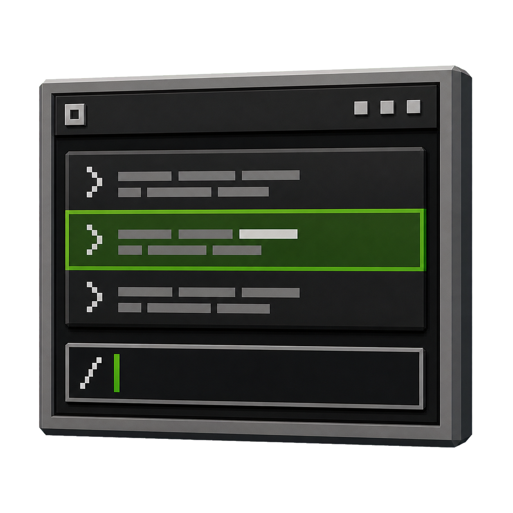

<p align="center">
  
</p>

<p align="center">
  
  
  
  
</p>

# LibCommand

## Description

_An advanced, modular command framework for PocketMine-MP plugins. LibCommand provides typed arguments, execution constraints, dynamic command building, subcommand nesting, async execution, scheduled commands, command macros, interactive wizards, and full client-side UI integration via LibPacket._

## Features

- **Typed Arguments:** Define arguments with automatic parsing and validation (string, int, float, boolean, enum, soft enum, player, target, item, world, position, range).
- **Execution Constraints:** Gate commands behind permissions, cooldowns, rate limits, game modes, worlds, or console/in-game requirements.
- **Subcommand Nesting:** Organize complex commands with arbitrarily nested subcommands, each with their own arguments and constraints.
- **Dynamic Commands:** Build commands at runtime using a fluent builder API, without creating new classes.
- **Async Commands:** Execute long-running operations (database queries, HTTP requests) on worker threads without blocking the main thread.
- **Command Scheduling:** Delay or repeat command execution using the PocketMine task scheduler.
- **Command Macros:** Let players create personal aliases that execute multiple commands in sequence.
- **Interactive Wizards:** Guide players through multi-step input flows via chat.
- **Command History:** Track command execution per sender for debugging and auditing.
- **Help Generation:** Automatically produce detailed, compact, or usage-only help text for any command.
- **Permission Trees:** Visualize command hierarchies and permission access for players.
- **Batch Registration:** Register or unregister groups of commands in a single call.
- **Client UI Integration:** Intercepts `AvailableCommandsPacket` via LibPacket to provide dynamic autocomplete and command suggestions in the Bedrock client.

## How to Use

**Requirements:**
- PocketMine-MP API 5.0.0+
- PHP 8.2+
- [LibPacket](https://github.com/ImperaZim/LibPacket) (required dependency)

**Installation:**
- As a source library: place the `imperazim/command` namespace in your project's `src/` directory and ensure autoloading is configured.
- As a PHAR plugin: download the `.phar` release and place it in `plugins/`.

**Registering the interceptor** (required once per server, handled automatically if LibCommand is loaded as a plugin):

```php
use imperazim\command\LibCommandHooker;

// In your plugin's onEnable():
LibCommandHooker::registerInterceptor($this);
```

## Components

### `imperazim\command`

#### Highlights

- Added `Command` abstract class -- the base class for all custom commands. Extends PocketMine's `Command` with constraints, subcommands, typed arguments, help generation, custom messages, and automatic history recording.
- Added `SubCommand` abstract class -- represents a subcommand within a parent command or another subcommand. Supports nested subcommands, constraints, and argument parsing.
- Added `AsyncCommand` abstract class -- base class for commands that perform async operations on worker threads.
- Added `LibCommand` class -- the plugin entry point that registers the packet interceptor on enable.
- Added `LibCommandHooker` class -- static utility that registers the `LibCommandInterceptor` with LibPacket.
- Added `LibCommandInterceptor` class -- intercepts `AvailableCommandsPacket` to dynamically modify command UI based on player permissions and constraints.
- Added `CommandArguments` class -- array-like container for parsed arguments, implementing `ArrayAccess`, `IteratorAggregate`, and `Countable`.
- Added `CommandGroup` class -- utility for batch-registering or unregistering groups of commands.
- Added `CommandHistory` class -- tracks the last N commands executed per sender for debugging and auditing.
- Added `HelpGenerator` class -- generates automatic help text in detailed, compact, or usage-only formats.

#### Usage Examples

**Defining a basic command:**

```php
use pocketmine\plugin\Plugin;
use imperazim\command\Command;
use imperazim\command\result\CommandResult;
use imperazim\command\result\CommandFailure;

class PingCommand extends Command {

    public function onBuild(): array {
        return [
            'name' => 'ping',
            'description' => 'Shows your current ping',
            'aliases' => ['latency'],
            'permission' => 'myplugin.ping',
        ];
    }

    public function onExecute(CommandResult $result): void {
        $sender = $result->getSender();
        $sender->sendMessage("Pong! Label used: " . $result->getLabel());
    }

    public function onFailure(CommandFailure $failure): void {
        $failure->getSender()->sendMessage($failure->getMessage());
    }
}
```

**Defining a command with subcommands:**

```php
use pocketmine\plugin\Plugin;
use imperazim\command\Command;
use imperazim\command\SubCommand;
use imperazim\command\result\CommandResult;
use imperazim\command\result\CommandFailure;
use imperazim\command\argument\PlayerArgument;
use imperazim\command\argument\StringArgument;

class KickSub extends SubCommand {

    public function onBuild(): array {
        return [
            'name' => 'kick',
            'description' => 'Kick a player',
            'aliases' => ['k'],
            'arguments' => [
                new PlayerArgument('target'),
                new StringArgument('reason', optional: true, default: 'No reason'),
            ],
        ];
    }

    public function onExecute(CommandResult $result): void {
        $target = $result->getArgumentsList()->get('target');
        $reason = $result->getArgumentsList()->get('reason') ?? 'No reason';
        $result->getSender()->sendMessage("Kicked {$target->getName()}: $reason");
    }

    public function onFailure(CommandFailure $failure): void {
        $failure->getSender()->sendMessage($failure->getMessage());
    }
}

class AdminCommand extends Command {

    public function onBuild(): array {
        return [
            'name' => 'admin',
            'description' => 'Administrative commands',
            'permission' => 'myplugin.admin',
            'subcommands' => [
                new KickSub($this),
            ],
        ];
    }

    public function onExecute(CommandResult $result): void {
        $result->getSender()->sendMessage("Usage: /admin <kick>");
    }

    public function onFailure(CommandFailure $failure): void {
        $failure->getSender()->sendMessage($failure->getMessage());
    }
}
```

**Async command example:**

```php
use pocketmine\plugin\Plugin;
use pocketmine\command\CommandSender;
use imperazim\command\AsyncCommand;
use imperazim\command\result\CommandFailure;
use imperazim\command\argument\StringArgument;

class LookupCommand extends AsyncCommand {

    public function onBuild(): array {
        return [
            'name' => 'lookup',
            'description' => 'Look up player data asynchronously',
            'arguments' => [
                new StringArgument('player'),
            ],
        ];
    }

    protected function prepareAsyncData(array $args): mixed {
        return $args; // pass serializable data to the worker
    }

    public function onAsyncComplete(CommandSender $sender, mixed $data, array $args, string $label): void {
        $sender->sendMessage("Lookup complete for: " . ($data['player'] ?? 'unknown'));
    }

    public function onFailure(CommandFailure $failure): void {
        $failure->getSender()->sendMessage($failure->getMessage());
    }
}
```

**Batch registration with CommandGroup:**

```php
use imperazim\command\CommandGroup;

// Register multiple command instances
CommandGroup::register($plugin, [
    new PingCommand($plugin),
    new AdminCommand($plugin),
]);

// Or register from class names
CommandGroup::registerClasses($plugin, [
    PingCommand::class,
    AdminCommand::class,
]);

// Unregister
CommandGroup::unregister($plugin, $commands);
```

**Querying command history:**

```php
use imperazim\command\CommandHistory;

// Get last 10 commands for a player
$entries = CommandHistory::get("Steve", limit: 10);

// Get the most recent command
$last = CommandHistory::getLast("Steve");
// Returns: ['command' => '/tp', 'args' => ['Steve'], 'timestamp' => 1712700000.0]

// Clear history
CommandHistory::clear("Steve");
CommandHistory::clearAll();
```

**Generating help text:**

```php
use imperazim\command\HelpGenerator;

// Detailed help
$help = HelpGenerator::generate($command, "detailed");

// Compact help
$help = HelpGenerator::generate($command, "compact");

// Usage-only
$help = HelpGenerator::generate($command, "usage");

// Subcommand help
$help = HelpGenerator::generateSubCommand($subcommand, "admin", "detailed");
```

---

### `imperazim\command\argument`

#### Highlights

- Added `Argument` abstract class -- base class for all argument types. Supports names, optional/required flags, default values, descriptions, aliases, custom validators, tab-completion suggestions, and network parameter data generation.
- Added `StringArgument` class -- accepts any string input. Consumes multiple tokens when followed by more arguments.
- Added `IntegerArgument` class -- parses integer values with optional min/max range constraints.
- Added `FloatArgument` class -- parses floating-point values with optional min/max range constraints.
- Added `BooleanArgument` class -- accepts `true`, `false`, `yes`, `no`, `1`, `0` and parses to `bool`.
- Added `EnumArgument` class -- restricts input to a fixed set of predefined string choices (hard enum). Provides client-side autocomplete.
- Added `SoftEnumArgument` class -- uses dynamically updateable enums via `CommandEnumManager`. Values can change at runtime without re-registering commands.
- Added `PlayerArgument` class -- resolves online player names by prefix, returning a `Player` object.
- Added `TargetArgument` class -- resolves entity/player targets including selector syntax (`@a`, `@e`, `@p`, `@r`, `@s`) with filter arguments.
- Added `ItemArgument` class -- parses item identifiers using PocketMine's `StringToItemParser` and legacy parser.
- Added `WorldArgument` class -- resolves loaded world names, returning a `World` object.
- Added `PositionArgument` class -- parses 3D coordinates (`x y z`) with support for relative notation (`~`, `~5`).
- Added `RangeArgument` class -- parses numeric ranges in `min..max` format with optional absolute bounds.

#### Usage Examples

**Using typed arguments:**

```php
use imperazim\command\argument\StringArgument;
use imperazim\command\argument\IntegerArgument;
use imperazim\command\argument\FloatArgument;
use imperazim\command\argument\BooleanArgument;
use imperazim\command\argument\PlayerArgument;
use imperazim\command\argument\ItemArgument;
use imperazim\command\argument\WorldArgument;
use imperazim\command\argument\TargetArgument;
use imperazim\command\argument\PositionArgument;
use imperazim\command\argument\RangeArgument;

// Required string
new StringArgument('name');

// Optional integer with min/max and default
new IntegerArgument('amount', optional: true, default: 1, min: 1, max: 64);

// Float with range
new FloatArgument('speed', optional: false, min: 0.1, max: 10.0);

// Boolean with description
new BooleanArgument('confirm', optional: true, description: 'Confirm the action');

// Player (resolves to Player object)
new PlayerArgument('target');

// Item (resolves to Item object)
new ItemArgument('item');

// World (resolves to World object)
new WorldArgument('world', optional: true);

// Target with selector support (@a, @e, @p, @r, @s)
new TargetArgument('entity');

// Position with relative coordinates (100 64 200 or ~ ~1 ~)
new PositionArgument('location');

// Range (e.g., "1..10" or "5")
new RangeArgument('level', optional: false, absoluteMin: 1, absoluteMax: 100);
```

**Using enum arguments:**

```php
use imperazim\command\argument\EnumArgument;
use imperazim\command\argument\SoftEnumArgument;
use imperazim\command\enum\CommandEnumManager;
use pocketmine\network\mcpe\protocol\types\command\CommandSoftEnum;

// Hard enum (fixed choices)
new EnumArgument('color', optional: false, choices: ['red', 'blue', 'green']);

// Soft enum (dynamic, updateable at runtime)
CommandEnumManager::addEnum(new CommandSoftEnum("warps", ["spawn", "pvp", "shop"]));
new SoftEnumArgument('warp', optional: false, enumName: 'warps');

// Update values later -- all connected clients are notified
CommandEnumManager::updateEnum("warps", ["spawn", "pvp", "shop", "arena"]);

// Remove an enum
CommandEnumManager::removeEnum("warps");
```

**Custom argument with validator:**

```php
use imperazim\command\argument\StringArgument;

// Custom validator: only accept lowercase alphanumeric names
new StringArgument('username', optional: false, validator: function(mixed $value): bool {
    return (bool) preg_match('/^[a-z0-9_]{3,16}$/', (string) $value);
});
```

**Creating a custom argument type:**

```php
use imperazim\command\argument\Argument;
use pocketmine\command\CommandSender;
use pocketmine\network\mcpe\protocol\AvailableCommandsPacket;

class UppercaseStringArgument extends Argument {

    public function getTypeName(): string {
        return 'upperstring';
    }

    public function getNetworkType(): int {
        return AvailableCommandsPacket::ARG_TYPE_STRING;
    }

    public function canParse(string $testString, CommandSender $sender): bool {
        return strtoupper($testString) === $testString;
    }

    public function parse(string $argument, CommandSender $sender): mixed {
        return strtoupper($argument);
    }
}
```

---

### `imperazim\command\constraint`

#### Highlights

- Added `Constraint` abstract class -- base class for all execution constraints. Defines the contract with `isSatisfiedBy()`, `onFailure()`, `onSuccess()`, and `getDescription()`.
- Added `PermissionConstraint` class -- enforces that the sender holds a specific permission node. Supports custom failure messages.
- Added `CooldownConstraint` class -- enforces a cooldown period (in seconds) between command uses per sender. Tracks usage via UUID.
- Added `RateLimiterConstraint` class -- caps total command usage within a sliding time window (e.g., max 3 uses per 60 seconds). Unlike `CooldownConstraint`, allows bursts.
- Added `InGameConstraint` class -- requires the sender to be an in-game player (not console).
- Added `RequireConsoleConstraint` class -- requires the sender to be the server console (not a player).
- Added `WorldConstraint` class -- restricts command usage to one or more specific worlds.
- Added `GameModeConstraint` class -- restricts command usage to a specific game mode (Survival, Creative, Adventure, or Spectator).

#### Usage Examples

**Applying constraints in onBuild:**

```php
use imperazim\command\Command;
use imperazim\command\result\CommandResult;
use imperazim\command\result\CommandFailure;
use imperazim\command\constraint\InGameConstraint;
use imperazim\command\constraint\CooldownConstraint;
use imperazim\command\constraint\WorldConstraint;
use imperazim\command\constraint\GameModeConstraint;
use imperazim\command\constraint\RateLimiterConstraint;
use pocketmine\player\GameMode;

class ArenaCommand extends Command {

    public function onBuild(): array {
        return [
            'name' => 'arena',
            'description' => 'Join the arena',
            'permission' => 'myplugin.arena',
            'cooldown' => 10.0, // shorthand: 10-second cooldown
            'constraints' => [
                new InGameConstraint(),
                new WorldConstraint(['lobby', 'arena']),
                new GameModeConstraint(GameMode::SURVIVAL),
                new RateLimiterConstraint(maxUses: 5, windowSeconds: 60.0),
            ],
        ];
    }

    public function onExecute(CommandResult $result): void {
        $result->getSender()->sendMessage("Joining the arena...");
    }

    public function onFailure(CommandFailure $failure): void {
        $failure->getSender()->sendMessage($failure->getMessage());
    }
}
```

**Console-only command:**

```php
use imperazim\command\constraint\RequireConsoleConstraint;

// In onBuild():
'constraints' => [
    new RequireConsoleConstraint(),
],
```

**Custom constraint:**

```php
use imperazim\command\constraint\Constraint;
use pocketmine\command\CommandSender;
use pocketmine\player\Player;

class VIPConstraint extends Constraint {

    public function isSatisfiedBy(CommandSender $sender): bool {
        return $sender instanceof Player && $sender->hasPermission('group.vip');
    }

    public function onFailure(CommandSender $sender): void {
        $sender->sendMessage('This command is VIP-only!');
    }

    public function getDescription(): string {
        return 'Requires VIP rank';
    }
}
```

---

### `imperazim\command\result`

#### Highlights

- Added `CommandResult` class -- represents a successful command execution. Provides access to the sender, parsed `CommandArguments`, and the command label used.
- Added `CommandFailure` class -- represents a command execution failure with typed reason constants (`INVALID_ARGUMENT`, `MISSING_ARGUMENT`, `CONSTRAINT_FAILED`, `EXECUTION_ERROR`, `COOLDOWN`), contextual data, and formatted messages.

#### Usage Examples

**Working with CommandResult:**

```php
use imperazim\command\result\CommandResult;

public function onExecute(CommandResult $result): void {
    $sender = $result->getSender();
    $args = $result->getArgumentsList();
    $label = $result->getLabel();

    // Access arguments by name
    $target = $args->get('target');
    $amount = $args->get('amount', 1); // with default

    // Iterate over all arguments
    foreach ($args as $name => $value) {
        $sender->sendMessage("$name = $value");
    }

    // Array-like access
    $count = count($args);
    $exists = isset($args['target']);
}
```

**Handling CommandFailure:**

```php
use imperazim\command\result\CommandFailure;

public function onFailure(CommandFailure $failure): void {
    $sender = $failure->getSender();
    $reason = $failure->getReason();

    switch ($reason) {
        case CommandFailure::MISSING_ARGUMENT:
            $sender->sendMessage("Missing arguments: " . $failure->getMessage());
            break;
        case CommandFailure::INVALID_ARGUMENT:
            $sender->sendMessage("Invalid input: " . $failure->getMessage());
            break;
        case CommandFailure::CONSTRAINT_FAILED:
            // Constraints already notify the sender via onFailure()
            break;
        case CommandFailure::EXECUTION_ERROR:
            $data = $failure->getData();
            $sender->sendMessage("Error: " . ($data['message'] ?? 'Unknown'));
            break;
        case CommandFailure::COOLDOWN:
            $sender->sendMessage("Please wait before using this again.");
            break;
    }
}
```

---

### `imperazim\command\dynamic`

#### Highlights

- Added `DynamicCommand` class -- a fluent builder for creating commands at runtime without defining new classes. Supports all features of `Command` via method chaining and closure callbacks.
- Added `DynamicSubCommand` class -- a fluent builder for creating subcommands at runtime. Supports closure-based execution and failure handlers.

#### Usage Examples

**Building a command dynamically:**

```php
use imperazim\command\dynamic\DynamicCommand;
use imperazim\command\dynamic\DynamicSubCommand;
use imperazim\command\argument\StringArgument;
use imperazim\command\argument\IntegerArgument;
use imperazim\command\constraint\InGameConstraint;
use imperazim\command\result\CommandResult;
use imperazim\command\result\CommandFailure;

$cmd = DynamicCommand::create($plugin, 'give')
    ->withDescription('Give items to a player')
    ->withAliases(['g'])
    ->withPermission('myplugin.give')
    ->addConstraint(new InGameConstraint())
    ->addArgument(new StringArgument('item'))
    ->addArgument(new IntegerArgument('amount', optional: true, default: 1, min: 1, max: 64))
    ->setOnExecute(function (CommandResult $result): void {
        $sender = $result->getSender();
        $item = $result->getArgumentsList()->get('item');
        $amount = $result->getArgumentsList()->get('amount') ?? 1;
        $sender->sendMessage("Giving {$amount}x {$item}");
    })
    ->setOnFailure(function (CommandFailure $failure): void {
        $failure->getSender()->sendMessage($failure->getMessage());
    });

$cmd->registerCommand();
```

**Building dynamic subcommands:**

```php
use imperazim\command\dynamic\DynamicCommand;
use imperazim\command\dynamic\DynamicSubCommand;
use imperazim\command\argument\StringArgument;
use imperazim\command\result\CommandResult;
use imperazim\command\result\CommandFailure;

$cmd = DynamicCommand::create($plugin, 'warp')
    ->withDescription('Manage warps');

$setSub = DynamicSubCommand::create($cmd, 'set')
    ->setDescription('Set a warp at your location')
    ->addArgument(new StringArgument('name'))
    ->setOnExecute(function (CommandResult $result): void {
        $name = $result->getArgumentsList()->get('name');
        $result->getSender()->sendMessage("Warp '$name' set!");
    })
    ->setOnFailure(function (CommandFailure $failure): void {
        $failure->getSender()->sendMessage($failure->getMessage());
    });

$cmd->addSubCommand($setSub);
$cmd->registerCommand();
```

---

### `imperazim\command\scheduler`

#### Highlights

- Added `CommandScheduler` class -- schedules command execution in the future using PocketMine's task scheduler. Supports delayed one-shot execution, repeating execution with optional max runs, task cancellation by ID, and listing active tasks.

#### Usage Examples

```php
use imperazim\command\scheduler\CommandScheduler;

// Initialize once (typically in onEnable)
CommandScheduler::init($plugin);

// Run a command after 5 seconds (100 ticks)
CommandScheduler::delay($sender, "broadcast The game starts!", 100);

// Run a command every second (20 ticks), with an ID for cancellation
CommandScheduler::repeat($sender, "say tick!", 20, "heartbeat");

// Run a command 5 times, once per second
CommandScheduler::repeat($sender, "say countdown!", 20, "countdown", maxRuns: 5);

// Cancel a specific task
CommandScheduler::cancel("heartbeat");

// Check if a task is active
$active = CommandScheduler::isActive("heartbeat");

// Get all active task IDs
$tasks = CommandScheduler::getActiveTasks();

// Cancel all scheduled tasks
CommandScheduler::cancelAll();
```

---

### `imperazim\command\macro`

#### Highlights

- Added `CommandMacro` class -- allows players to create personal command aliases that execute multiple commands in sequence. Supports creation with limits (max 20 macros, max 10 commands each), execution, removal, listing, existence checks, and automatic cleanup on disconnect.

#### Usage Examples

```php
use imperazim\command\macro\CommandMacro;

// Create a macro that runs three commands in sequence
CommandMacro::create($player, "attack", ["/kit pvp", "/heal", "/tp arena"]);

// Execute the macro
CommandMacro::execute($player, "attack");

// Check if a macro exists
if (CommandMacro::exists($player, "attack")) {
    $commands = CommandMacro::get($player, "attack");
}

// List all macros for a player
$macros = CommandMacro::getList($player);

// Remove a macro
CommandMacro::remove($player, "attack");

// Clean up on player quit (call in PlayerQuitEvent handler)
CommandMacro::cleanup($player);
```

---

### `imperazim\command\wizard`

#### Highlights

- Added `CommandWizard` class -- an interactive step-by-step wizard that collects input from players via chat. Each step asks a question and processes the answer through a closure handler. Supports data storage between steps, completion and cancellation callbacks, and automatic cleanup. Only one wizard can be active per player at a time. Players type `cancel` to abort.

#### Usage Examples

```php
use imperazim\command\wizard\CommandWizard;
use pocketmine\player\Player;

$wizard = new CommandWizard($plugin, $player, "Create Warp");

$wizard->step("What is the warp name?", function (Player $p, string $answer, CommandWizard $w): bool {
    if (strlen($answer) < 3) {
        $p->sendMessage("Name must be at least 3 characters.");
        return false; // repeat this step
    }
    $w->setData("name", $answer);
    return true; // proceed to next step
});

$wizard->step("Should it be public? (yes/no)", function (Player $p, string $answer, CommandWizard $w): bool {
    if (!in_array(strtolower($answer), ['yes', 'no'])) {
        $p->sendMessage("Please answer yes or no.");
        return false;
    }
    $w->setData("public", strtolower($answer) === 'yes');
    return true;
});

$wizard->onComplete(function (Player $p, array $data): void {
    $p->sendMessage("Warp '{$data['name']}' created! Public: " . ($data['public'] ? 'yes' : 'no'));
});

$wizard->onCancel(function (Player $p): void {
    $p->sendMessage("Warp creation cancelled.");
});

$wizard->start();

// Check if player has an active wizard
$hasWizard = CommandWizard::hasActiveWizard($player);

// Clean up on quit (call in PlayerQuitEvent handler)
CommandWizard::cleanup($player);
```

---

### `imperazim\command\permission`

#### Highlights

- Added `CommandPermissionTree` class -- generates a visual, color-coded permission tree showing command hierarchies, arguments, subcommands, and constraint requirements. Colors indicate access (green) or denial (red) based on the viewer's permissions.

#### Usage Examples

```php
use imperazim\command\permission\CommandPermissionTree;

// Generate a tree for all commands (no viewer context)
$tree = CommandPermissionTree::generate($commands);

// Generate with viewer permissions (color-coded)
$tree = CommandPermissionTree::generate($commands, $player);

// Send tree directly to a player
CommandPermissionTree::sendTo($player, $commands);

// Generate tree for a single command with full details
$tree = CommandPermissionTree::forCommand($command, $player);
```

---

### `imperazim\command\enum`

#### Highlights

- Added `CommandEnumManager` class -- manages soft command enums (dynamic suggestion lists). Supports adding, updating, and removing enums at runtime with automatic broadcast to all connected players via `UpdateSoftEnumPacket`.

#### Usage Examples

```php
use imperazim\command\enum\CommandEnumManager;
use pocketmine\network\mcpe\protocol\types\command\CommandSoftEnum;

// Register a new soft enum
CommandEnumManager::addEnum(new CommandSoftEnum("kits", ["warrior", "archer", "mage"]));

// Update values (broadcasts to all players)
CommandEnumManager::updateEnum("kits", ["warrior", "archer", "mage", "healer"]);

// Retrieve an enum
$enum = CommandEnumManager::getEnumByName("kits");
$values = $enum?->getValues();

// Get all registered enums
$allEnums = CommandEnumManager::getEnums();

// Remove an enum
CommandEnumManager::removeEnum("kits");
```

---

### `imperazim\command\exception`

#### Highlights

- Added `ArgumentException` class -- a `RuntimeException` thrown for argument-related errors during parsing, validation, or constraint violations.

#### Usage Examples

```php
use imperazim\command\exception\ArgumentException;

// Thrown automatically by argument types on parse failure.
// Can also be thrown in custom argument implementations:
throw new ArgumentException("Value must be a positive number");
```

---

### `imperazim\command\traits`

#### Highlights

- Added `SubCommandTrait` -- provides subcommand registration, retrieval by name, and listing. Used internally by `Command`.
- Added `ArgumentableTrait` -- provides argument registration, validation, raw argument parsing (with special handling for `PositionArgument` and `StringArgument` multi-token consumption), and usage string generation. Used internally by `Command` and `SubCommand`.
- Added `ConstraintableTrait` -- provides constraint registration, retrieval (including by type), and batch testing against a `CommandSender`. Calls `onSuccess()` on all constraints when all pass, or `onFailure()` on failed constraints. Used internally by `Command` and `SubCommand`.

---

## Licensing information

This project is licensed under MIT. Please see the [LICENSE](/LICENSE) file for details.

## EasyLibrary internal package asset

LibCommand remains available as a standalone PHAR. Starting with the EasyLibrary
3.x migration, the release workflow can also publish an internal package asset:

```txt
LibCommand-2.0.0.easylib.zip
package.yml
checksums.txt
```

The `.easylib.zip` package is intended for EasyLibrary's internal package
manager and is installed under:

```txt
plugin_data/EasyLibrary/packages/libcommand/<version>/
```

The standalone PHAR remains the correct option for servers that want LibCommand
without EasyLibrary.
